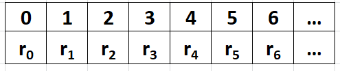

# URM (Unlimited Register Machine)

An unlimited register machine (URM) is an abstraction of a very primitive computer.
It consists of a left-handed tape which stretches indefinitely to the right (hence) 
the word 'unlimited'). The tape is divided into squares called registers, as illustrated by 
the diagram below. (You may think of the tape as an array; each cell is accessed 
using an index starting at 0)

Each register r[i] can store a single non-negative integer. In the diagram above, the 
content of the i-th register is r[i]. The function of the tape is storage for inputs and 
outputs.

The core of a URM is its program which is a finite sequence of numbered instructions 
(described below). The program of a URM is responsible for carrying out computations. 
When a program is run, the contents of the registers may change on the tape. The execution 
of the program may or may not end.

The instruction in the program is executed in sequence. When there are no more instructions 
to execute, the program terminates.

The pre-defined instructions that make up the program of a URM come in four basic types:
1. zero operation Z(n), which changes the content of register n to 0.
r[n] = 0
2. successor operation S(n), which increases the content of register n by 1.
r[n] = r[n] + 1
3. transfer operation T(m, n), which writes (or transfers) the content of register m to 
that of register n.
r[n] = r[m]
4. jump operation J(m, n, p), which, when encountered in a program, 'jumps' to the pth 
instruction whenever the contents of registers m and n are the same.

The inputs to the program are written on the first few registers, the remaining registers 
are assumed to have 0 as value. If the program requires two inputs, for example, the first 
2 registers contain the input. The output of the computation is always stored on the first 
register, overwriting whatever is there.

#### Example 1. f(x, y) = x + y
The program below computes the sum of two numbers. The inputs are two numbers found on the 
first two registers. When the program terminates the first register contains the sum.
1. J(1, 2, 5)
2. S(0)
3. S(2)
4. J(1, 1, 1)

#### Example 2. f(x) = {0 if x = 0, x - 1 if >= 1}
The program subtracts 1 from the input (located in the first register). If the input is 0, it 
simply ignores it.
1. J(0, 1, 8)   // checks if input is 0
2. S(1)         // comparison count
3. J(0, 1, 7)   // see if input is equal to comparison count
4. S(1)         // increment count
5. S(2)         // increment the actual result
6. J(1, 1, 3)   // go back to instruction 3
7. T(2, 0)      // transfer actual result to proper register

#### Construct URM for each of the following:
1. f(x, y) = {x if x < y, x - y if x >= y}
2. f(x, y) = x mod y
3. f(x, y) = gcd(x, y)
